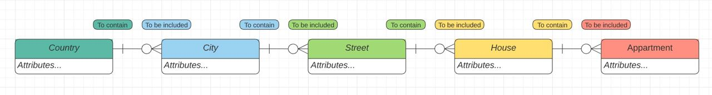
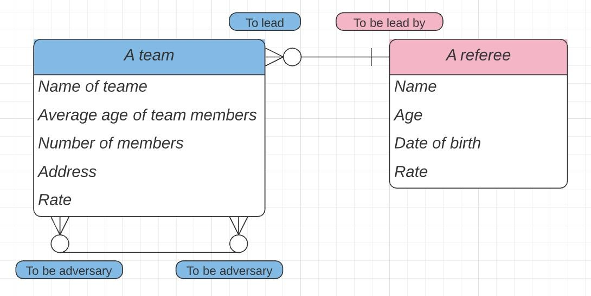
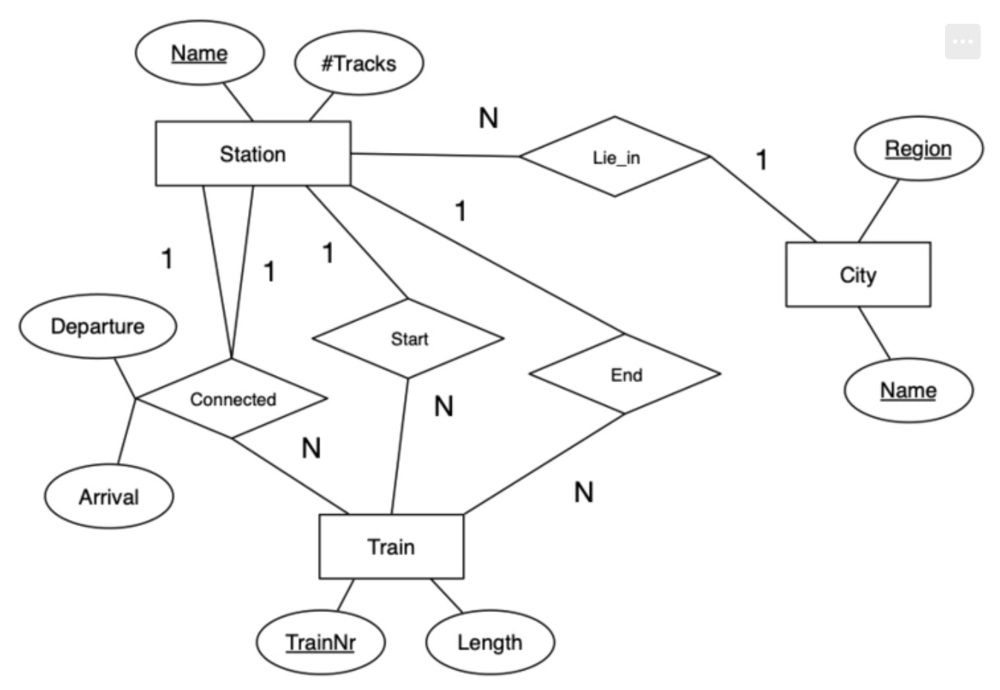
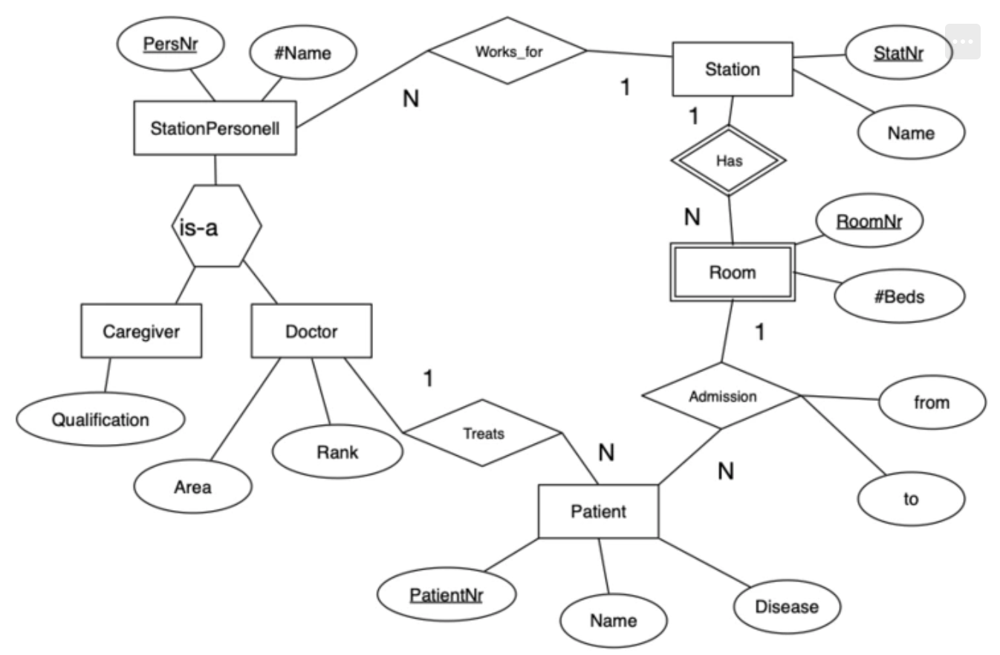

# Домашнее задание 3
# Асташкина Мария БПИ 196

## Задание 1. 
Вопрос:

Почему любое отношение в реляционной схеме имеет по крайней мере один ключ?

Ответ: 

Реляционная модель данных — это способ рассмотрения данных, то есть предписание для способа представления данных (посредством таблиц) и для способа работы с таким представлением (посредством операторов). Отношение — это плоская (двумерная) таблица, состоящая из столбцов и строк. Таким образом, реляционная база данных – это набор нормализованных отношений. Свойства отношений:

- уникальное имя отношения;
- уникальное имя атрибута;
- нет одинаковых кортежей;
- кортежи не упорядочены сверху вниз;
- атрибуты не упорядочены слева направо;
- все значения атрибутов атомарные (нормализованное отношение).

Значит, что каждое отношение – уникально. Для того, чтобы уметь идентифицировать его нам необходим ключ. Иначе, мы не можем однозначно определить уникальный кортеж, то есть не будет уникального отношения. Следовательно, у каждого отношения должен быть как минимум один ключ. 

Задание 2. 

Задание:

Переведите все диаграммы ER из предыдущей домашней работы в реляционные схемы.

Ответ: 

Реляционная схема:

|Book|({ISBN: int, Year of publishment: int, Name of a book: string, Author’s name: string, Amount of pages: int})|
| :- | :- |
|Publisher|({PablisherId: int, Name: string, Address: string})|
|Category|({Name: string, Major category: string})|
|Duplicate|({ISBN (of a book): int, ID of copy: int, Position on shelf: int})|
|Reader|({ReaderId: int, Name: string, Surname: string, Address: string, Date of birth: datetime})|
|
Returning 

a book
|({ReaderId: int, Id of copy: int, Return date: datetime})|
|
Book-

Category
|({ISBN: int, Category name: string})|

|Country|({CountryId: int})|
| :- | :- |
|City|({CityId: int, CountryId: int})|
|Street|({StreetId: int, CityId: int, CountryId: int})|
|House|({HouseId: int, StreetId: int, CityId: int, CountryId: int})|
|Apartment|({ApartmentId: int, HouseId: int, StreetId: int, CityId: int, CountryId: int})|

   

|A team|({TeamId: int, Name of team: string, Average age: int, Number of members: int, Address: string, Rate: int})|
| :- | :- |
|A referee |({RefereeId: int, Name: string, Age: int, Date of birth: datetime, Rate: int})|
|
Team-

Referee
|(FirstTeamId: int, SecondTeamId: int, RefereeId: int)|

1. 

|Female|({FemaleId: int, MotherId: int, FatherId: int, Name: string, Age: int, Date of birth: datetime})|
| :- | :- |
|Male|({MaleId: int, MotherId: int, FatherId: int, Name: string, Age: int, Date of birth: datetime})|

1. 

|Attributes|({AttibutesDesignation: string, Is it a key: bool, EntityDesignation: string })|
| :- | :- |
|Entity|({EntityDesignation: string})|
|Connection|({CoonctionType: string, FirstEntityDesignation: string, SecondEntityDesignation: string, RoleType: string})|
|Role|({RoleType: string})|

## Задание 3. 

1. 

|Station|({StationName: string, #Tracks: int, CityName: string, CityRegion: String})|
| :- | :- |
|Train|({TrainNR: int, Length: int, StrtingStationName: string, EndingStationName: string})|
|City|({CityName: string, RegionName: string})|
|Connected|({DepatureTime: datetime, ArrivalTime: datetime, TrainNr: int, FromStationName: string, ToStationName: string})|

1. 

|Station|({StatNr: int, StationName: string})|
| :- | :- |
|StationPersonell|({PersNr: int, #Name : string, StatNr: int})|
|Room|({RoomNr: int, #Beds: int, StatNr: int})|
|Doctor|({PersNr: int, Area: string, Rank: int})|
|Caregiver|({PersNr: int, Qualification: string})|
|Patient|({PatientNr: int, Name: string, Disease: string, DoctorPersNr: int, RoomNr: int, AdmissionFrom: string, AdmissionTo: string})|
|Admission|({PatientNr: int, RoomNr: int, AdmissionFrom: string, AdmissionTo: string})|

