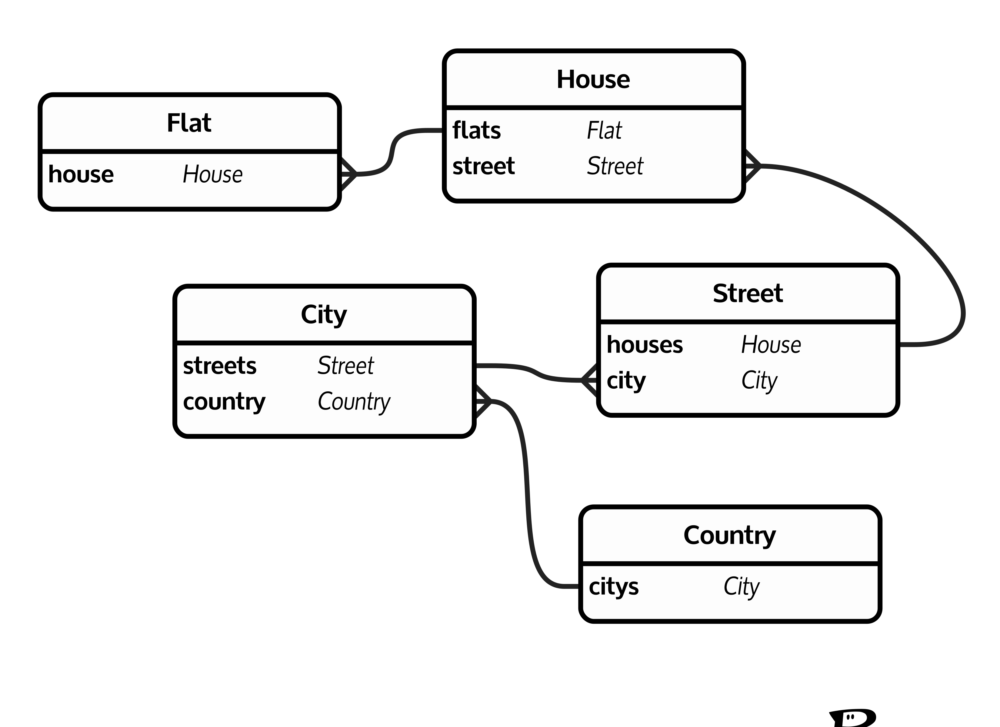
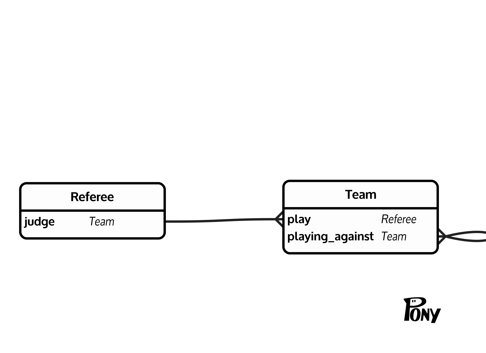
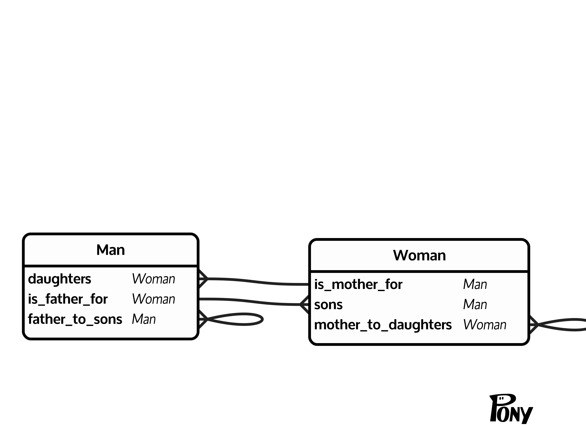

# Задание 1.
## Почему любое отношение в реляционной схеме имеет по крайней мере один ключ?
По определению ключ - это набор атрибутов, однозначно определяющий кортеж отношения. Отношение - это множеством кортежей, а т.к. множества не содержат дубликатов -  следует, что множество всех атрибутов кортежа для него является ключом, потому что определяют его однозначно.
# Задание 2.
Переведите все диаграммы ER из предыдущей домашней работы в реляционные схемы.
## 1.
Book: {[ <ins>ISBN</ins>, publisher_id, author, year, name, pages ]}
Category: {[ <ins>Id</ins>, name, category_id ]}
Book_instance: {[ <ins>ISBN</ins>, <ins>copy_number</ins>, place_on_shelf ]}
Publishing_house: {[ <ins>id</ins>, name, address ]}
Book: {[ <ins>ISBN</ins>, <ins>category_id</ins> ]}
Booking: {[ <ins>id</ins>, reading_number, ISBN, book_instances, return_date ]}
Reader: {[ <ins>number</ins>, surname, name, address, birth_date ]}

## 2.1.
Flat: {[ <ins>id</ins>, number, house_id ]}
House: {[ <ins>id</ins>, number, street_id ]}
Street: {[ <ins>id</ins>, name, city_id ]}
City: {[ <ins>id</ins>, name, country_id ]}
Country: {[ <ins>id</ins>, name ]}

## 2.2.
Referee: {[ <ins>id</ins> ]}
Team: {[ <ins>id</ins>, referee_id ]}
Match: {[ <ins>id</ins>, first_team, second_team ]}

## 2.3.
Man: {[ <ins>id</ins>, father_id, mother_id ]}
Woman: {[ <ins>id</ins>, father_id, mother_id ]}

## 3.
Essence: {[ <ins>name</ins> ]}
Connection: {[ <ins>name</ins> ]}
Essence-Connection: {[ <ins>essence_name</ins>, <ins>connection_name</ins> ]}
Attribute: {[ <ins>name</ins>, <ins>essence_name</ins>, is_key_part ]}

# Задание 3.
Переведите приведенные диаграммы ER в реляционные схемы.
## 3.1
**Диаграмма:**

**Реляционная схема:**
City: {[ <ins>Name</ins>, <ins>Region</ins> ]}
Train: {[ <ins>TrainNr</ins>, Length, StartStation, EndStation ]}
Station: {[ <ins>Name</ins>, #Tracks, CityName, CityRegion ]}
Connection: {[ <ins>TrainNr, Departure</ins>, Arrival, FromStation, ToStation ]}
## 3.2
**Диаграмма:**

**Реляционная схема:**
Doctor: {[ <ins>PersNr</ins>, #Name, StationNr, Area, Rank ]}
Patient: {[ <ins>PatientNr</ins>, Name, Disease, DoctorNr, RoomNr, AdmissionFrom, AdmissionTo]}
Caregiver: {[ <ins>PersNr</ins>, #Name, StationNr, Qualification ]}
Station: {[ <ins>StatNr</ins>, Name ]}
Room: {[ <ins>RoomNr</ins>, #Beds, StationNr ]}
StationPersonell: {[ <ins>PersNr</ins>, #Name, StationNr ]}
