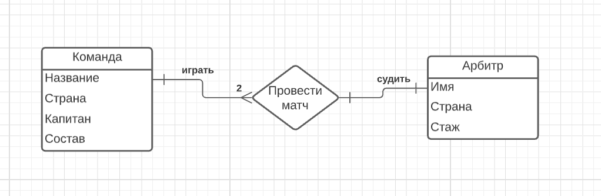

# Домашнее задание 3 Сахаров Никита БПИ196

## Задача 1

Роль ключа в том чтобы однозначно идентифицировать записи в таблице. Отношение заданное без какого либо ключа может
иметь неопределенную ситуацию, если в таблицах есть повторяющиеся записи.

## Задача 2

### Книги                      

- Книга: {[<ins>ISBN</ins>, Name, Year, Author, PageCount, CategoryId]}
<!---в копии номер копии - слабый ключ -->
- Копия: {[<ins>CopyNumber</ins>, Position, ISBN]}
- Издательство: {[<ins>CompanyName</ins> CompanyName, Address]}
- Категория: {[<ins>id</ins>, Name, ParentId]}
- Аренда книги: {[<ins>id</ins>, Date, CopyID, ReaderId]}
- Читатель: {[<ins>id</ins>, Name, Surname, Date]}

### Квартира

- Квартира: {[<ins>id</ins>, HouseId ]}
- Дом: {[<ins>id</ins>, StreetId]}
- Улица: {[<ins>id</ins>, CityId]}
- Город: {[<ins>id</ins>, CountryId]}
- Страна: {[<ins>id</ins>]}
  

### Футбол

- Арбитр: {[<ins>id</ins>, Name, Country]}
- Команда: {[<ins>id</ins>, Name, Country, Captain, Team]}

- Игра: {[HomeTeamId, OpponentTeamId, RefereeId]}
  

### Люди

+ Мужчина: {[<ins>id</ins>,Age, Name, Surname, FatherId, MotherId]
+ Женщина: {[<ins>id</ins>, Age, Name, Surname, FatherId, MotherId]}

  

### ER диаграммы

- Сущность: {[<ins>id</ins>, Name, AttributeIds]}
- Связь: {[<ins>id</ins>, Name, Type]}
- Свойство: {[<ins>id</ins>, Name, EntityId]}
- Роль: {[<ins>id</ins>, Name, RelationshipId ]}

- Быть в связи:{[RelationshipId, EntityIds, RoleIds]}

## Задача 3

### 3.1

- Station: {[<ins>Name<ins>, #Tracks, City]}
- Train: {[<ins>TrainNr</ins>, Length, StartStation, EndStation]}
- City: {[<ins>Name<ins>, Region]}

- connected: {[currentStation, nextStation, TrainNrs, Arrival, Departure]}
  

### 3.2

- StationPersonell: {[<ins>PersNr</ins>, #Name, StationNr]}
- Station: {[<ins>StatNr</ins>, Name, ]}
- Room: {[RoomNr, StatNr, #Beds]}
- Patient: {[PatientNr, Name, Disease, DoctorNr, RoomNr, AdmissionFrom, AdmissionTo]}
- Doctor: {[StationPersonellNr, Area, Rank]}
- Caregiver: {[Qualification, StationPersonellNr]}

  
