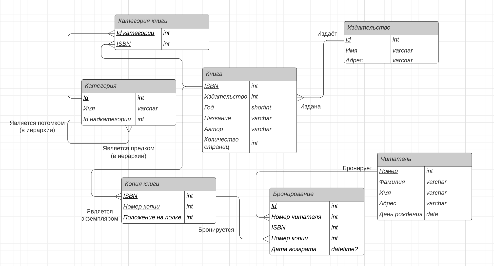
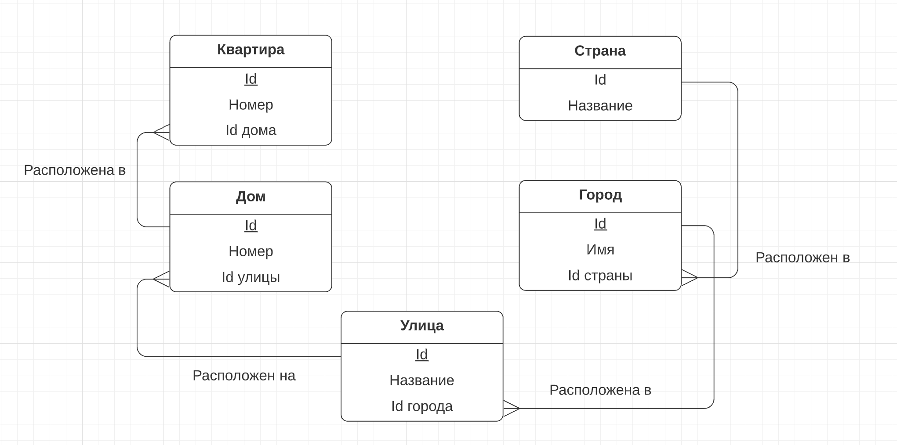
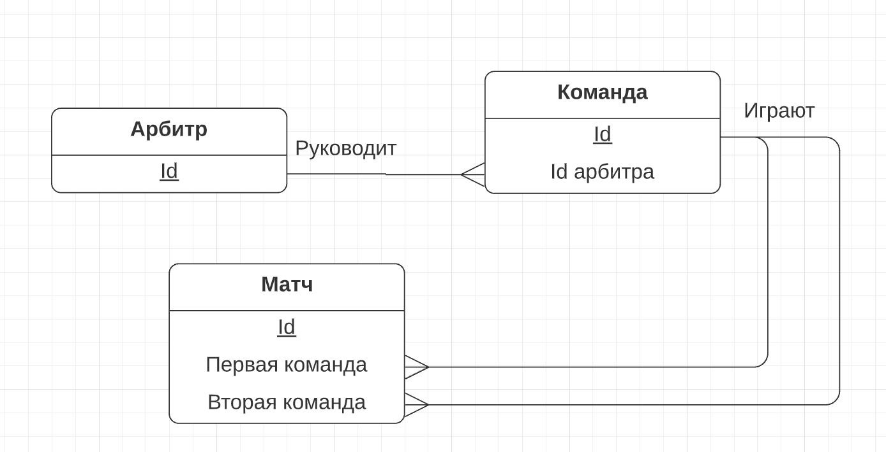
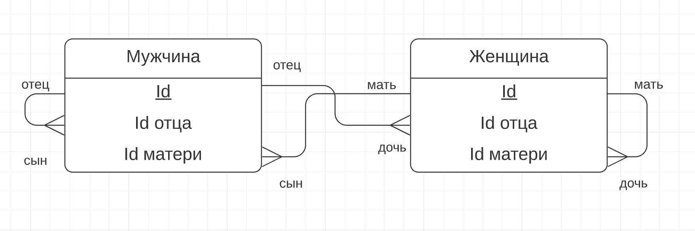
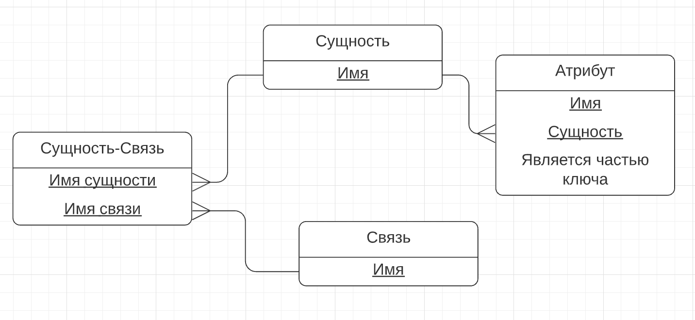

# Задание 1.
## Почему любое отношение в реляционной схеме имеет по крайней мере один ключ?

Ключ - это набор атрибутов, однозначно определяющий кортеж отношения.

По определению, отношение является множеством кортежей, а множества не содержат дубликатов. Это означает, что для любого кортежа множество всех его атрибутов является ключом (так как однозначно его идентифицируют).

# Задание 2.
Переведите все диаграммы ER из предыдущей домашней работы в реляционные схемы.
## 1.

Книга: {[ <ins>ISBN</ins>, Id издателя, Год, Название, Автор, Количество страниц ]}

Копия книги: {[ <ins>ISBN</ins>, <ins>Номер копии</ins>, Положение на полке ]}

Издательство: {[ <ins>Id</ins>, Имя, Адрес ]}

Категория: {[ <ins>Id</ins>, Имя, Id над-категории ]}

Категория книги: {[ <ins>ISBN</ins>, <ins>Id категории</ins> ]}

Читатель: {[ <ins>Номер</ins>, Фамилия, Имя, Адрес, День рождения ]}

Бронирование: {[ <ins>Id</ins>, Номер читателя, ISBN, Номер копии, Дата возврата ]}

## 2.1.

Квартира: {[ <ins>Id</ins>, Номер, Id дома ]}

Дом: {[ <ins>Id</ins>, Номер, Id улицы ]}

Улица: {[ <ins>Id</ins>, Название, Id города ]}

Город: {[ <ins>Id</ins>, Имя, Id страны ]}

Страна: {[ <ins>Id</ins>, Название ]}

## 2.2.

Арбитр: {[ <ins>Id</ins> ]}

Команда: {[ <ins>Id</ins>, Id арбитра ]}

Матч: {[ <ins>Id</ins>, Первая команда, Вторая команда ]}

## 2.3.

Мужчина: {[ <ins>Id</ins>, Id отца, Id матери ]}

Женщина: {[ <ins>Id</ins>, Id отца, Id матери ]}

## 3.

Сущность: {[ <ins>Имя</ins> ]}

Связь: {[ <ins>Имя</ins> ]}

Сущность-Связь: {[ <ins>Имя сущности</ins>, <ins>Имя связи</ins> ]}

Артибут: {[ <ins>Имя</ins>, <ins>Имя сущности</ins>, Является частью ключа ]}

# Задание 3.
Переведите приведенные диаграммы ER в реляционные схемы.
## 3.1
E/R диаграмма:

Реляционная схема:

City: {[ <ins>Name</ins>, <ins>Region</ins> ]}

Station: {[ <ins>Name</ins>, #Tracks, CityName, CityRegion ]}

Train: {[ <ins>TrainNr</ins>, Length, StartStation, EndStation ]}

Connection: {[ <ins>TrainNr, Departure</ins>, Arrival, FromStation, ToStation ]}

## 3.2
E/R диаграмма:

Реляционная схема:

StationPersonell: {[ <ins>PersNr</ins>, #Name, StationNr ]}

Caregiver: {[ <ins>PersNr</ins>, #Name, StationNr, Qualification ]}

Doctor: {[ <ins>PersNr</ins>, #Name, StationNr, Area, Rank ]}

Station: {[ <ins>StatNr</ins>, Name ]}

Room: {[ <ins>RoomNr</ins>, #Beds, StationNr ]}

Patient: {[ <ins>PatientNr</ins>, Name, Disease, DoctorNr, RoomNr, AdmissionFrom, AdmissionTo]}

